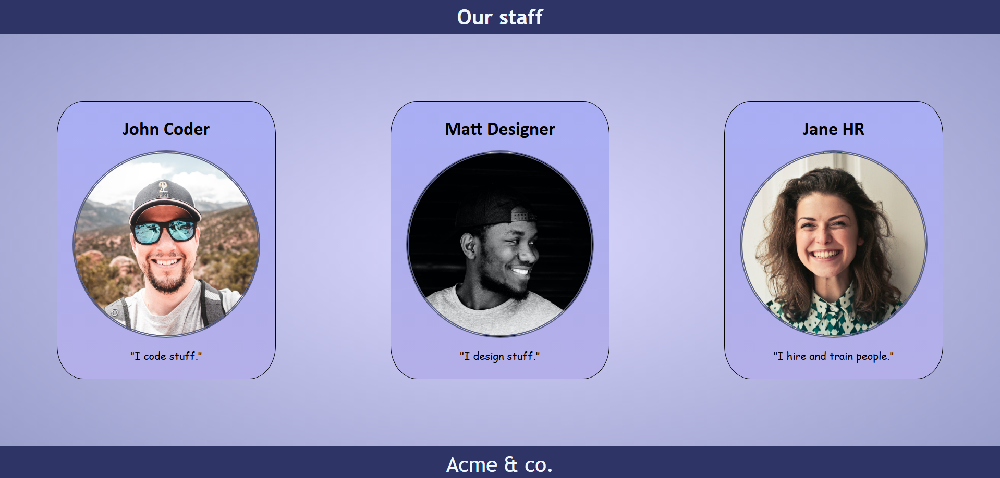
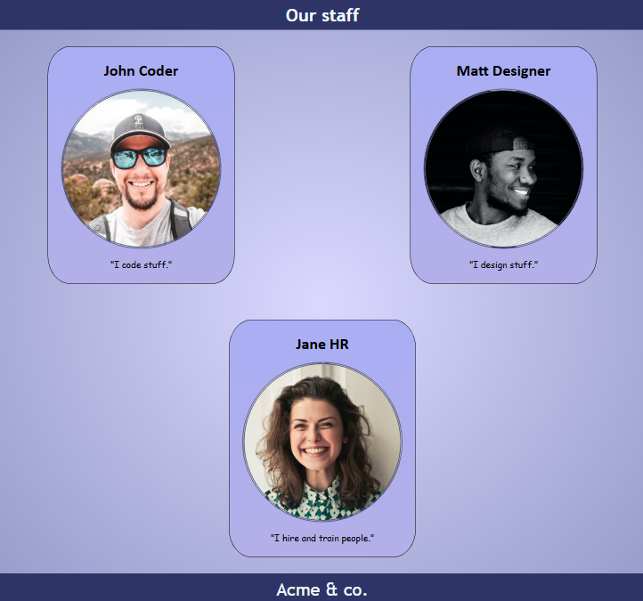
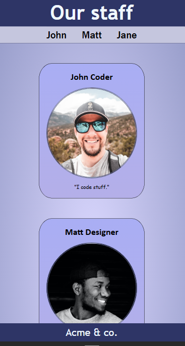

# Media Queries Test

## Description

This mini-project is a simple web page demonstrating the use of HTML and CSS to create a responsive design. Titled "Our staff," it showcases profiles of three Acme & co. employees: John Coder, Matt Designer, and Jane HR. Each profile includes a name, photo (as a background image), and a brief description.

## Key features:

- Responsive Design: Media queries adapt the layout for various screen sizes (mobile, tablet, desktop). A navigation bar appears on screens below 768px for quick profile access.
- Flexbox: Profile container uses Flexbox for flexible element arrangement.
- Styling: Gradient page background, linear gradients for profile cards, circular photos with borders, sticky header and footer.
- SEO and Meta Tags: Includes meta tags for description, author, keywords, Open Graph for social media, and a favicon.
- Accessibility: Simple structure with semantic tags (header, main, footer, section), no alt texts needed (photos as backgrounds), but design ensures readability.

The project is designed for practicing basic web development skills and testing media queries. No JavaScript—pure HTML/CSS.

## Screenshots

- Desktop Version (>1250px)

(Profiles in a row, no navbar)
- Tablet Version (768px-1250px)

(Profiles in wrap, with spacing)
- Mobile Version (<768px)

(Vertical stack, visible navbar for navigation)

## Installation

- Clone the repository:
  ```bash
  git clone https://github.com/Mihasik556/Project-MQueries-Test.git
  ```
  
Open index.html in any browser.

No dependencies—works locally without a server.

## Usage

Open index.html in a browser.
Resize the browser window to see responsive changes.
Use developer tools (DevTools) in Chrome/Firefox to test on mobile devices.
Navigation: On mobile, click navbar links to scroll to profiles (with smooth scroll).

## Technologies

- HTML5: Page structure.
- CSS3: Styling, Flexbox, media queries, gradients, transitions (hover on links).
- No Frameworks: Pure vanilla CSS to demonstrate basic capabilities.

### Author

Mihail Gurgurov
GitHub: Mihasik556

License
This project is licensed under the MIT License. See LICENSE for details.
